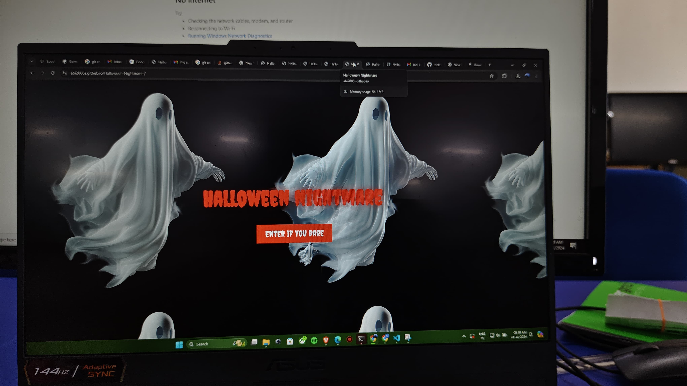
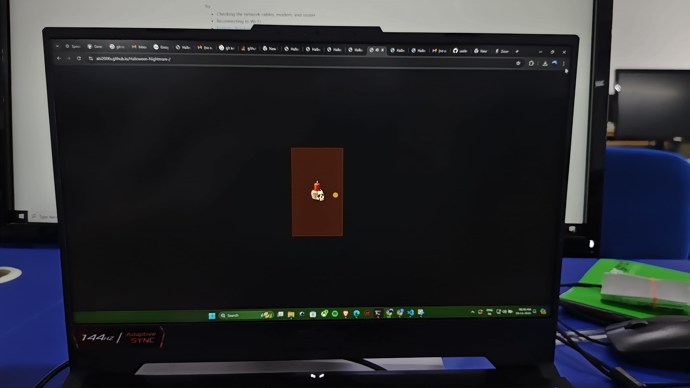
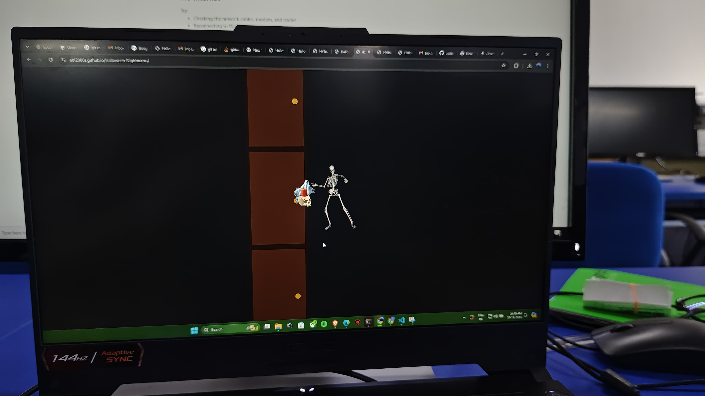
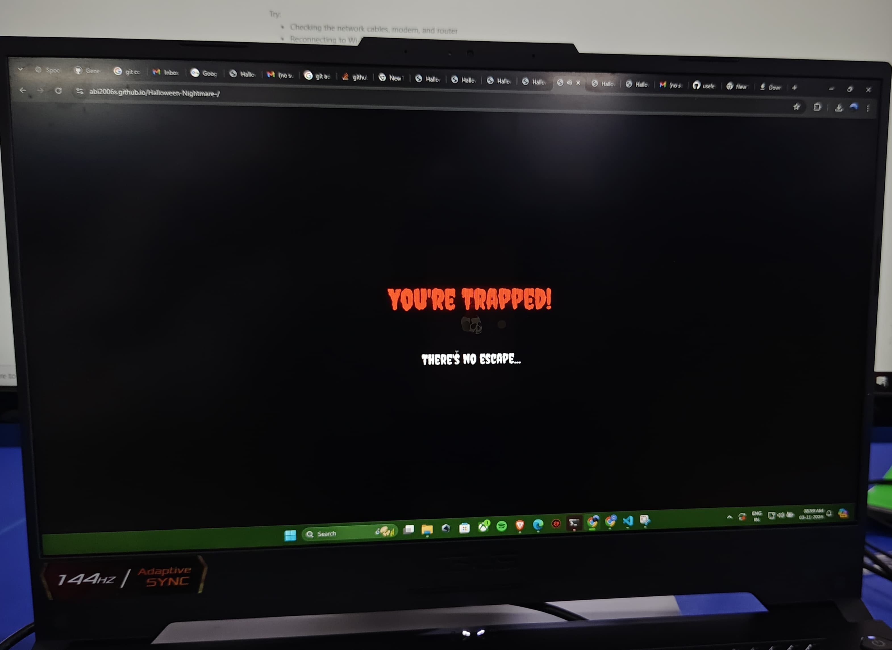

# Halloween Nightmare 🎯

## Basic Details
### Team Name: INNOV8ORS

### Team Members
- Team Lead: Abin Varughese John - MBCCET, Peermade
- Member 2: Amal Santhosh - MBCCET, Peermade
- Member 3: Biban J Roy - MBCCET, Peermade
### Project Description
A haloween theamed project which might scare everyone with the loop setup.. once entered they cant get back
### The Problem (that doesn't exist)
fun theme ... checks the fear of people in a sarcastic way 
### The Solution (that nobody asked for)
how to get out of this ...
## Technical Details
### Technologies/Components Used
For Software:
- html,css,js
- frameworks: html,javascript,css
- Libraries used:Gsap,Howler
- chatgpt,v0.dev,claude.ai,githubcodespace,vscode,replit etc.

For Hardware:
- [List main components]
- [List specifications]
- [List tools required]

### Implementation
For Software:

[commands]

# Run
[commands]

### Project Documentation
For Software:

# Screenshots (Add at least 3)

this is the landing page 

*Add caption explaining what this shows*

the first door .. the place where the scene starts on clicking this will lead to another room with 2 doors then on clicking one of the door this leads to 3rd room 
![Screenshot3]
 the 3rd room with 3 doors clicking any one of the door will show a prompt as show in the pic and then redirects to 1st or starting point (This is a loop)
# Diagrams

*Add caption explaining your workflow*

For Hardware:

# Schematic & Circuit

*Add caption explaining connections*

*Add caption explaining the schematic*

# Build Photos

*List out all components shown*

*Explain the build steps*

*Explain the final build*

### Project Demo
# Video
https://drive.google.com/file/d/1OBRQ51FIms7IjaSEMYK-V0a5pO9krDxV/view?usp=drivesdk
*Explain what the video demonstrates*
the video indicates about the project mentioned above ...
clicking the link of website . The landing page should be an old 3d shaped rockbuilding with only one door ... The building can be creative and aesthetic in different ways. .. should give an old texture... The site should give an interactive texture on mouse clicks... On clicking the first door ... The door should open showing the inner room with 2 other doors ... The inner room should be creative and give an old texture with rocks..balcony on the side , old tv with some cracks , a broken aquarium .. should be arranged in a creative way .. a pair of old chairs and the 2 other doors as I mentioned earlier.. one should be on the left and one should be on the right ... Should show some animation like , some mosquitos or bees flying across the room, the room should get a lighting in an old way .. the lighting should give a spooky feel , or give a low light texture ...the doors should be detailed i mean some walking spiders on the web to the doors ... Etc and when the doors open show the spider webs shrinking ... These detailings are enough for the inner room ... On clicking either of the doors it should move to the 3rd room which gives more spooky feel with 3 doors ... 
The detailing should be the same as I mentioned earlier but on this one the lighting should be different .. a flickering light setup which gives totally a horror feel .. and the 3rd room should contain a skeliton in the corner , should contain all other details as I mentioned earlier.. Now on clicking any of the 3 doors this will move to the 1st door setup... Which means this is a loop and no going back is there and at last a dialogue " You are ripped " 

# Additional Demos
[Add any extra demo materials/links]

## Team Contributions
- Abin Varughese John: html, css, js code devolopment or combining other codes
- Amal Santhosh: Github and git connecting
- Biban J Roy : ai enquiery and libraries

---
Made with ❤️ at TinkerHub Useless Projects 

